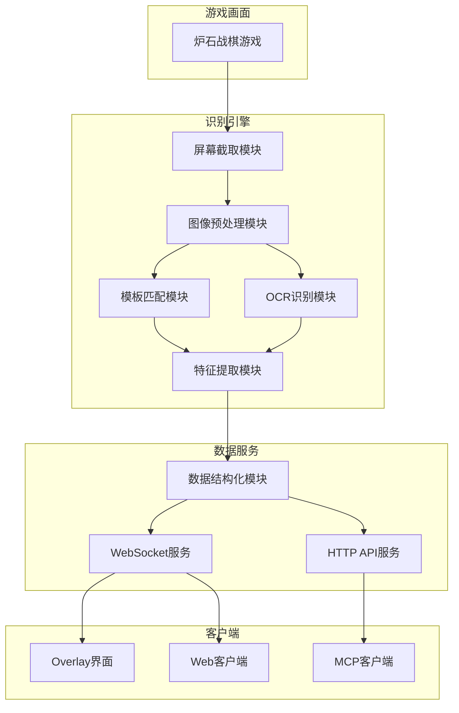
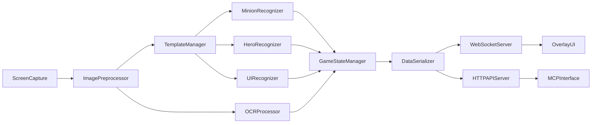
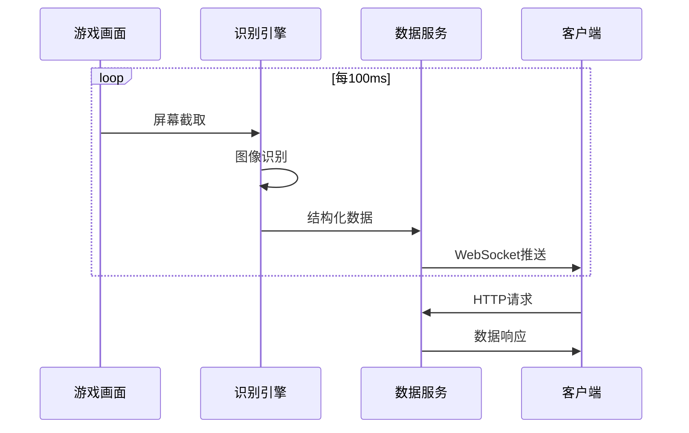

# DESIGN_auto_coach

## 整体架构图



## 分层设计和核心组件

### 1. 数据采集层
- **ScreenCapture**: 实时屏幕截取
- **ImagePreprocessor**: 图像预处理和ROI分割
- **TemplateManager**: 模板资源管理

### 2. 识别分析层
- **MinionRecognizer**: 随从识别
- **HeroRecognizer**: 英雄识别
- **UIRecognizer**: UI状态识别
- **OCRProcessor**: 数字和文字识别

### 3. 数据服务层
- **GameStateManager**: 游戏状态管理
- **DataSerializer**: 数据序列化
- **WebSocketServer**: WebSocket服务
- **HTTPAPIServer**: HTTP API服务

### 4. 接口层
- **OverlayUI**: 游戏内覆盖界面
- **MCPInterface**: MCP集成接口
- **WebInterface**: Web管理界面

## 模块依赖关系图



## 接口契约定义

### 1. 识别引擎接口
```python
class RecognitionEngine:
    def recognize_frame(self, frame: np.ndarray) -> GameState:
        """识别单帧图像，返回游戏状态"""
        pass
    
    def get_template_match(self, roi: np.ndarray, template_id: str) -> MatchResult:
        """模板匹配接口"""
        pass
    
    def get_ocr_result(self, roi: np.ndarray) -> str:
        """OCR识别接口"""
        pass
```

### 2. WebSocket接口
```python
class WebSocketServer:
    async def broadcast_game_state(self, game_state: GameState):
        """广播游戏状态"""
        pass
    
    async def handle_client_connection(self, websocket: WebSocket):
        """处理客户端连接"""
        pass
```

### 3. HTTP API接口
```python
class HTTPAPIServer:
    @app.get("/api/game-state")
    async def get_game_state() -> GameState:
        """获取当前游戏状态"""
        pass
    
    @app.get("/api/recognition-status")
    async def get_recognition_status() -> RecognitionStatus:
        """获取识别状态"""
        pass
```

## 数据流向图



## 异常处理策略

### 1. 识别异常处理
- **模板匹配失败**: 降级到OCR识别或返回未知状态
- **OCR识别失败**: 使用历史数据或默认值
- **图像质量差**: 降低识别频率，等待画面稳定

### 2. 服务异常处理
- **WebSocket连接断开**: 自动重连，保持服务稳定
- **HTTP请求失败**: 返回错误码和错误信息
- **系统资源不足**: 降低识别频率，释放内存

### 3. 数据异常处理
- **数据格式错误**: 数据验证和清理
- **数据缺失**: 使用默认值或历史数据
- **数据不一致**: 数据一致性检查和修复

## 性能优化策略

### 1. 识别优化
- **ROI缓存**: 缓存固定的游戏界面区域
- **模板预加载**: 预加载所有模板资源
- **并行处理**: 多线程并行识别不同区域

### 2. 服务优化
- **连接池**: WebSocket连接池管理
- **数据压缩**: 压缩传输数据
- **缓存策略**: 缓存常用数据

### 3. 系统优化
- **内存管理**: 及时释放图像数据
- **CPU调度**: 智能调整识别频率
- **资源监控**: 实时监控系统资源使用
