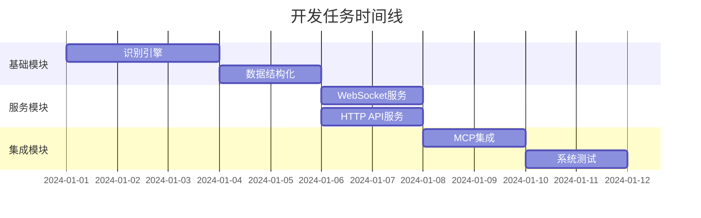

# TASK_auto_coach

## 子任务拆分

### 任务1: 基础识别引擎
**输入契约**
- 前置依赖：OpenCV、numpy、现有图片资源
- 输入数据：屏幕截图
- 环境依赖：Windows环境、Python 3.8+

**输出契约**
- 输出数据：基础的游戏状态数据
- 交付物：RecognitionEngine类
- 验收标准：能识别基本的游戏界面元素

**实现约束**
- 技术栈：OpenCV模板匹配
- 接口规范：符合RecognitionEngine接口定义
- 质量要求：识别准确率 > 80%

**依赖关系**
- 后置任务：WebSocket服务、数据结构化
- 并行任务：无

### 任务2: 数据结构化模块
**输入契约**
- 前置依赖：识别引擎、现有JSON数据结构
- 输入数据：识别结果
- 环境依赖：Python标准库

**输出契约**
- 输出数据：结构化的GameState对象
- 交付物：GameStateManager类
- 验收标准：数据结构完整、格式正确

**实现约束**
- 技术栈：Python dataclass、JSON序列化
- 接口规范：符合数据结构设计文档
- 质量要求：数据完整性100%

**依赖关系**
- 后置任务：WebSocket服务、HTTP API
- 并行任务：无

### 任务3: WebSocket服务
**输入契约**
- 前置依赖：数据结构化模块、FastAPI
- 输入数据：游戏状态数据
- 环境依赖：FastAPI、uvicorn

**输出契约**
- 输出数据：WebSocket连接和数据推送
- 交付物：WebSocketServer类
- 验收标准：支持多客户端连接、数据推送稳定

**实现约束**
- 技术栈：FastAPI + WebSocket
- 接口规范：符合WebSocket接口定义
- 质量要求：连接稳定性 > 95%

**依赖关系**
- 后置任务：MCP集成
- 并行任务：HTTP API服务

### 任务4: HTTP API服务
**输入契约**
- 前置依赖：数据结构化模块、FastAPI
- 输入数据：游戏状态数据
- 环境依赖：FastAPI、uvicorn

**输出契约**
- 输出数据：HTTP API响应
- 交付物：HTTPAPIServer类
- 验收标准：API响应时间 < 100ms

**实现约束**
- 技术栈：FastAPI
- 接口规范：符合HTTP API接口定义
- 质量要求：响应时间 < 100ms

**依赖关系**
- 后置任务：MCP集成
- 并行任务：WebSocket服务

### 任务5: MCP集成
**输入契约**
- 前置依赖：HTTP API服务
- 输入数据：MCP工具调用
- 环境依赖：MCP协议

**输出契约**
- 输出数据：MCP工具响应
- 交付物：MCPInterface类
- 验收标准：MCP工具调用成功

**实现约束**
- 技术栈：MCP协议
- 接口规范：符合MCP工具定义
- 质量要求：调用成功率 > 99%

**依赖关系**
- 后置任务：系统测试
- 并行任务：无

### 任务6: 系统集成和测试
**输入契约**
- 前置依赖：所有模块完成
- 输入数据：完整的系统代码
- 环境依赖：完整的运行环境

**输出契约**
- 输出数据：测试报告
- 交付物：可运行的系统
- 验收标准：所有功能正常工作

**实现约束**
- 技术栈：Python测试框架
- 接口规范：符合系统设计要求
- 质量要求：功能完整性100%

**依赖关系**
- 后置任务：无
- 并行任务：无

## 任务依赖图

## 复杂度评估

### 任务1: 基础识别引擎
- **复杂度**: 高
- **原因**: 需要处理图像识别、模板匹配等复杂算法
- **风险**: 识别准确率可能不达标

### 任务2: 数据结构化模块
- **复杂度**: 中
- **原因**: 主要是数据转换和格式化
- **风险**: 数据结构设计可能不合理

### 任务3: WebSocket服务
- **复杂度**: 中
- **原因**: 需要处理并发连接和数据推送
- **风险**: 连接稳定性问题

### 任务4: HTTP API服务
- **复杂度**: 低
- **原因**: 标准的REST API实现
- **风险**: 性能问题

### 任务5: MCP集成
- **复杂度**: 中
- **原因**: 需要理解MCP协议
- **风险**: 协议兼容性问题

### 任务6: 系统集成和测试
- **复杂度**: 中
- **原因**: 需要协调多个模块
- **风险**: 集成问题

## 质量门控

### 代码质量
- 遵循PEP 8代码规范
- 单元测试覆盖率 > 80%
- 代码复杂度控制在合理范围

### 性能质量
- 识别延迟 < 200ms
- 内存使用 < 500MB
- CPU使用 < 30%

### 功能质量
- 识别准确率 > 90%
- 服务稳定性 > 95%
- 接口响应时间 < 100ms

### 文档质量
- 代码注释完整
- API文档清晰
- 使用说明详细
